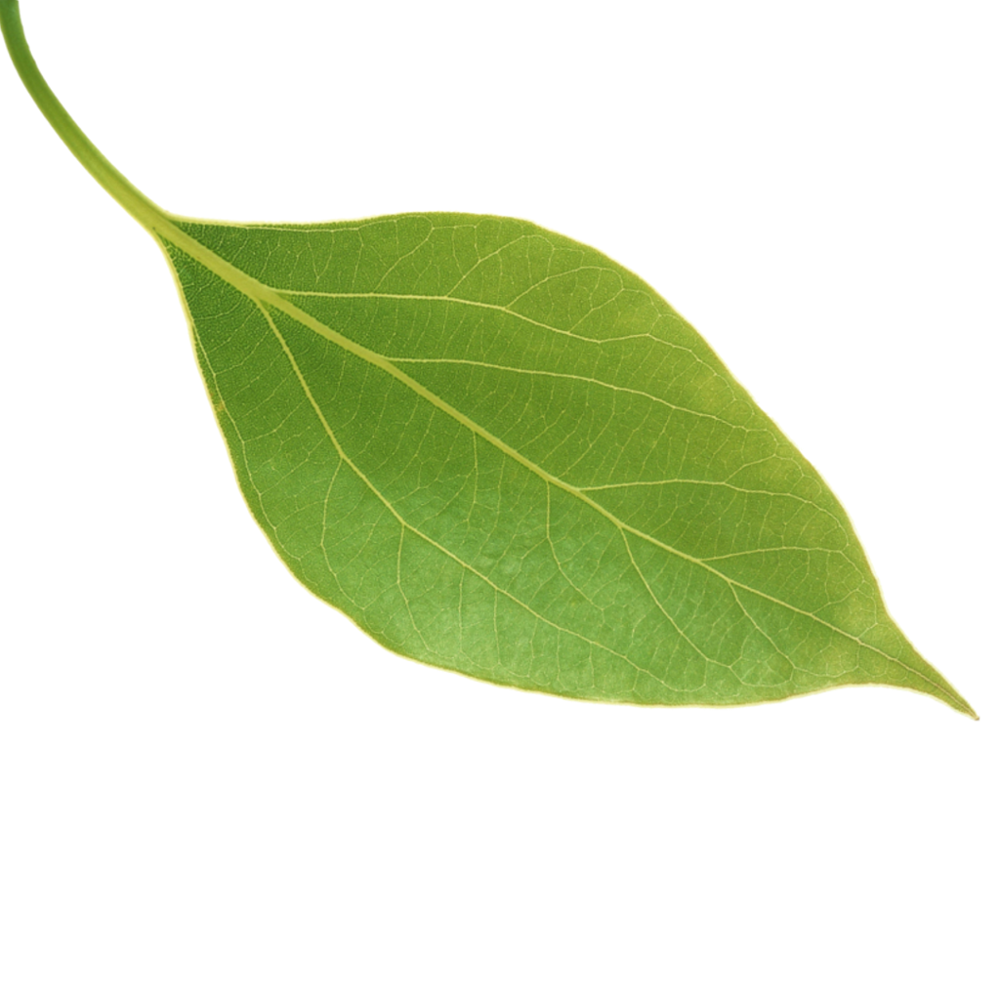
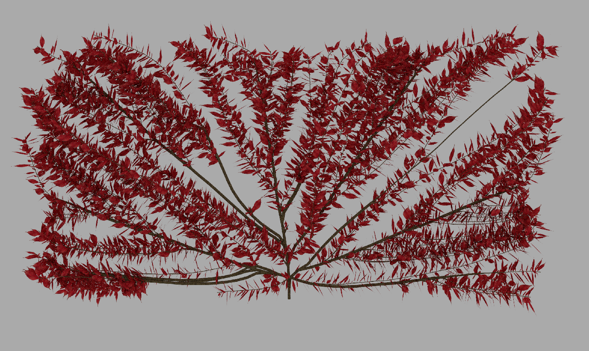
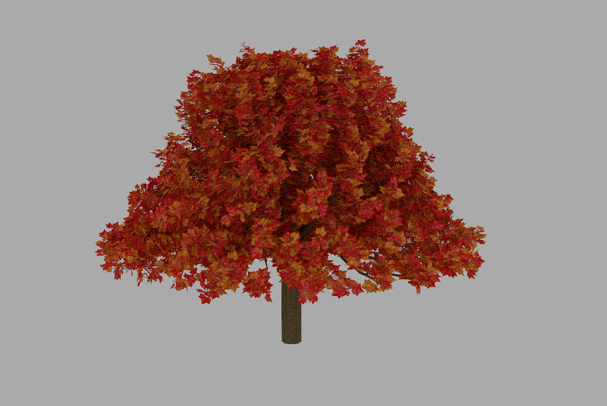

# MYOT
## Roberto Aureli

A space colonization based tool that generates tree of various types.
The project is heavely based on [Yocto/GL](https://github.com/xelatihy/yocto-gl) and follows the concept on the [Modeling Trees with a Space Colonization Algorithm](http://algorithmicbotany.org/papers/colonization.egwnp2007.large.pdf) paper.

___________________________________

## Implementation

Following the Yocto philosophy, a tree is seen as a Shape.
Starting from a point given by the user, the branches grow to reach a  cloud of attractors (points) scattered in the space following a known rule.\
Contrarily to the paper, Voronoi's set are not used but, for semplicity (at cost of performances), only a distance function is taken from Yocto to map the set of active attractors with respect to a growing branch.

An attractor is *active* when its sphere of influence contains a tree node that is growing.\
An attractor is *dead* (and then removed from the cloud) when it's under a certain distance from a node.

Starting from a generic tree node, the growth direction is decided by the average of the positions of active attractors in regard to that node. The length is a parameter.

Every node is considered in the growing loop untile no more attractor are alive or a certain number of branches is reached.

Initially a branch is a line that is then evolved to a mesh. The latter is a cylinder with an emisphere at the top used to fill the "holes" in the meshes that can be caused by the high angle of attack between two adiacent branches.\
The width of a branch is given by the *Da Vinci's formula* that put in relations the n-th power of the width of a parent branch to the n-th power of the widths of the childs. \
To keep track of every width, a matrix is built after traversing all the tree.\
A further loop is finally executed along all the final branches to add leaves following a *Logaritmic Spiral Distribution*.

## Usage

There is a plenty of parameters to decide the shape of a generic tree so, for the command line interface, only a little part of them is editable by the user (while in the main function everything is editable and commented to fine tune the tree).
Thanks to Yocto, there are two possible format to export the tree and the selection is really easy: just set *-o* <path name extension> to *.json* or *.obj* . With the JSON format the scene is populated with PLY objects.\
Make sure that the folder in which you want to save already exists.

### JSON settings

It is possible to set several parameters from the CLI. However, if you want to fine tune your tree, you can call the program with the *-j* (or *--json*) option and add the path to a *json* configuration file. 
The file *configuration.json* contains all the parameters.

### Single model mode

    -s true -t < 1|2|3 > --s-textures <path> --s-textures-opacity <path> ...

This mode helps with keeping everything in a compact way. A single texture is mapped over the trunk and the leaves giving the possibility to use up to 3 differents textures for the latter.
Following a clockwise disposition, the leaves textures need to be displaced in the right order to be taken by the software. 
The first frame is for the trunk texture. 


### Multiple models mode

    -s false --m-trunk-texture <path> --m-leaves-textures <path> --m-leaves-textures-opacity <path> -t <N> 

With multiple models, the generator will return one object for the trunk and *N* different objects for the leaves. Every leaves object is mapped to one of the *N* textures.\
There are some rules to follow to build a tree with this modality regarding the naming of the leaves textures.\
Name the texture with a final number that starts from 0 and goes to *N*-1 but does not include it in the *--m-leaves-textures* and *--m-leaves-textures-opacity* paths.\
Example:

> File on the disk:
>>trunk.png\
>>leaf_0.png\
>>leaf_1.png\
>>leaf_opacity_0.png\
>>leaf_opacity_1.png

> Parameters:
>>     -s false --m-trunk-texture "./trunk" --m-leaves-textures "./leaf_" --m-leaves-textures-opacity "./leaf_opacity_" -t 2 ...

Make sure to map exactly the index of the color texture to the one of the opacity texture.

There are two things that needs a little bit of attention when building a tree from scratches: 
1. Make sure that at least one attractor from the attractors cloud is within the *--influence-sphere* from the trunk
1. Is it possible to crash the program when chosing a trunk length that is not feasible: try a number that is divisible by *-D*
1. *--influence-sphere* and *--killing-radius* are strictly dependant on the given cloud shape, yielding really ugly trees if set wrong.

The run.sh helps by automatically generating a tree (loading the parameters from the tree_try.json) and displaying it using Yocto ysceneitrace.

### Leaves textures

In every modality, the texture of every leaf has one constraint: it should be oriented rotated by 45° as in the following picture.





## Table of CLI parameters
| Option                    | Description |
| ------                    | ----------- |
|  --json,-j                | JSON configuration file with more parameters
|  -o                       | Output file path
| -node, -n                 | Number of attractors
| --f-generator, -f         | Selection of the generating function
|--attractors_min, -m       | Attractors position lowerbound
|--attractors_max, -M       | Attractors position upperbound
|--z-offset, -z             | Offset on the z axis of the attractors
|--trunk-length             | Where the trunk will end and branches will begin
|--max-branches, -b         | Maxium number of different branches
|--branches-length, -l      | Lenght of a single branch
|--influence-sphere, -d     | Dimension of the influence sphere
|--killing-radius, -k       | Killing radius 
|--single-object, -s        | Single mode selector 
|--m-trunk-texture          | Path of the trunk texture in multi mode
|--m-leaves-textures        | Path of the leaves textures in multi mode
|--m-leaves-textures-opacity| Path of the leaves opacity textures in multi mode
|--s-textures               | Path of the texture in single mode
|--s-textures-opacity       | Path of the opacity texture in single mode
|--leaves-textures, -t      | Number of different leaves texture (max 3 for single mode)
|--leaves-max-dim           | Upperbound of the leaves dimension (0 for no leaves on the tree)

## List of all the parameters
```cpp
    // SHAPE PARAMETERS
        // Number of points to be included in the general shape
        int n_attractors;
        // Dimensions of the cube in which n_points attractors will be generated
        int attractors_range_min;
        int attractors_range_max;
        // Offset in the Z direction of the initial cube of points
        int attractors_z_offset;
        // Type of function to be used to generate the cloud
        int f_selector;
    // TREE PARAMETERS
        // Point in wich the tree will start to grow
        vec3f tree_starting_point;
        // Approximated point in wich the trunk will start to grow branches (trunk position)
        vec3f trunk_length;
        // Max number of tree nodes
        int max_nodes; 
        // Length of a generic branch
        float D;
        // Min width of a branch
        float W;
        // Max width of a branch, 50 is a good value (not in the same scale of W, it's just a constant that will be multiplied by W)
        float max_width;
        // Attractor inluence shpere
        float max_influence_sphere;
        // Attractor kill distance from a branch
        float max_killing_radius;
        //Eventual tropism (deformation or gravity) of a branch
        vec3f tropism;
    // LEAVES PARAMETERS
        // Min number of leaves in a single branch of lenght D
        int leaves_density_min;
        // Max number of leaves in a single branch of length D
        int leaves_density_max;
        // Max size of a leaf
        float leaf_size_max;
        // Min size of a leaf
        float leaf_size_min;
        // The following are 4 parameters of the logaritmic spiral used for distributing the leaves. 
        float a_spiral;
        float k_spiral;
        float e;
        float rounds;
    // Texture parameters
        // Number of differents leaves
        int leaves_textures_number;
        // For the texture, if you are using single object mode, don't worry. 
        // If you are using the multiple object mode, call the leaf texture with a index that start from 0 at the end.
        // For example:
            // leaf_texture_0.png
            // leaf_opacity_texture_0.png
            // leaf_texture_1.png
            // leaf_opacity_texture_1.png
        // And pass the path WITHOUT numbers and extension (hopefully a png)
            // leaf_texture_
            // leaf_opacity_texture_
        // Single object mode texture
        std::string single_mode_texture_path;
        std::string single_mode_opacity_texture_path;
        // Multiple object mode textures
        std::string multiple_mode_tree_texture_path;
        std::string multiple_mode_leaf_texture_path;
        std::string multiple_mode_leaf_opacity_texture_path;
        //Remember to have a shapes and textures folder!
        std::string export_name_path;
        int single_object;
        //Load configuration from JSON file
        std::string configuration_path;
```

## Performances

The code is not time optimized: it's a non-parallel implementation with simple math concepts, excluding structures (like Voronoi's) that could have improved the execution.
Nevertheless, even for a big tree, the time elapsed is accetable.
In the following table, a series of examples shows the time used to build and save the tree.
All the tree shares the same parameters but not the same number of branches.
With 10000 attractors: 

| Tree Branches | Single Mode | Multi Mode |
| ------------- | ----------- | ---------- |
| 500           | 0.2784s     | 0.4762s    |
| 2500          | 0.8008s     | 0.9821s    |
| 3309          | 1.0681s     | 1.2493s    |
| 5000*         | 6.0347s     | 6.2874s    |

*Limit of 3309 branches reached beacuse all the attractors were destroyed.
To reach 5000 branches is necessary to increase drammatically the number of attractors (from 10000 to 75000), hence the big time jump.
Note that the attractors generation process, even with 75000 attractors, took no more than 0.02 seconds.


## Examples

These are some trees build with the tree_generator and rendered with Yocto.
All the resources are taken from [textures.com](http://textures.com)

### Spherical tree 

    -n 10000 -b 5000 --trunk-length 3 -f 0 -z 5 -M 10 -m -10


### Strange rotational solid tree

    -n 1000 -b 1000 --trunk-length 1 -f 1 -z 0 -M 10 -m -10 -s 0 -t 1


### Same rotational solid as before


This is a better scene (with directional lights) than the one in the previous renders with a closeup to show better how the leaves are arranged.

### A tree climbing a wall



This tree grows attracted by a set of attractors that are distributed in a plane (with a minimal width)


### Dwarf Maple


This dwarf Maple is embedded in a cylinder and has three different types of leaves.

### Example scene composed in Blender

Finally, to show how Yocto handles the exports of a generic shape, a Tree is exported in OBJ extension and then put in a scene with Blender
(Environment texture taken from [HDRIhaven](https://hdrihaven.com/)):


